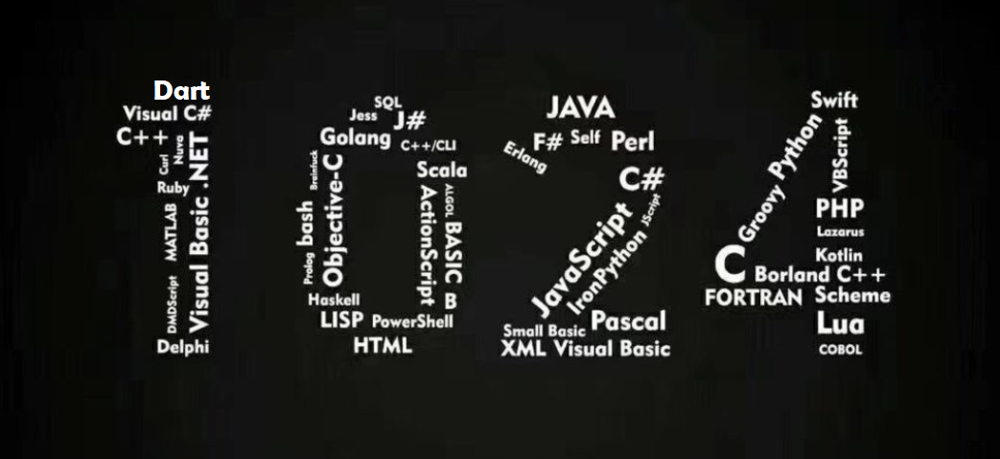

前几日完成的Dart Language Tour 翻译，回审了前几章，有好些错别字和翻译不规范。emmmm

好吧，我还是太菜了，翻译过程中有些操之过急。很多细节和本地链接都没完善。这些时日在学习Flutter，打算学习Flutter的途中，把该系列中的错别字，翻译不通顺，有歧义的地方都修改或者标注出来。FLutter学完能做项目之后，再回头看看Dart官网的[Effective Dart](https://dart.dev/guides/language/effective-dart)和[Core libraries](https://dart.dev/guides/libraries/library-tour)。有意翻译一下。总之坑先挖起来。

